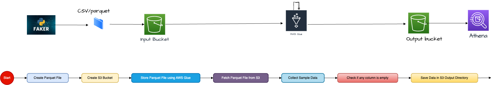
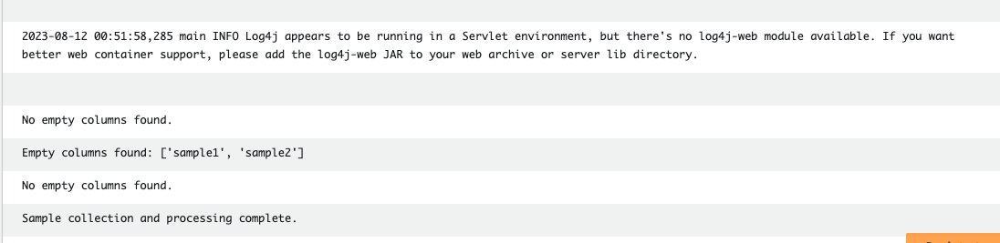

## ETL Process

Here's a diagram of the ETL process:




# Generating and Processing Data with AWS Glue

This guide will walk you through the process of setting up a virtual environment, generating sample CSV data using Faker, converting CSV to Parquet file format, uploading to Amazon S3, and using AWS Glue to process the data.

## Prerequisites

- Python (3.6+ recommended)
- AWS Account
- AWS CLI installed and configured

## Setup Virtual Environment

1. Create a new directory for your project and navigate into it.
2. Run the following commands to create and activate a virtual environment:

## Create a virtual environment
python3 -m venv venv

## Activate the virtual environment
source venv/bin/activate


## Generate CSV Data using Faker

1. Install the required packages:

2. Create a Python script to generate CSV data using Faker. Modify the script as needed for your data requirements.

3.Run the script to generate CSV data:

python generate_data.py

```Business data saved to business_data.csv```

# Convert CSV to Parquet and Upload to S3
1.Install the required packages:
    pip install pyarrow boto3
2. Modify the script to convert CSV to Parquet and upload to S3. Example script: convert_and_upload.py
3. Run the script to convert CSV to Parquet and upload to S3:
     python convert_and_upload.py

```python 03-local-csv-parqute.py 
Uploaded business_data_delta/0-c56c1622-361e-4264-bcbb-9cfc47803d28-0.parquet to S3://samplebucketforetl/deltatables/business_data_delta/0-c56c1622-361e-4264-bcbb-9cfc47803d28-0.parquet
Uploaded business_data_delta/_delta_log/00000000000000000000.json to S3://samplebucketforetl/deltatables/business_data_delta/00000000000000000000.json
Delta table uploaded to S3.```

# sample data show Glue job script 
glue_job_show_data.py
Jananiedujl@31
# Process Data with AWS Glue
Create an AWS Glue job to process the data:
Navigate to AWS Glue Console.
Click on "Jobs" in the left panel.
Click on "Add job".
Configure the job settings, including the data source, target location, and transformation script.
glue_job_pyspark_script.py



# Conclusion
You have successfully set up a virtual environment, generated CSV data using Faker, converted it to Parquet file format, uploaded it to Amazon S3, and used AWS Glue to process the data. save to output folder in s3 and using anthen verifty data